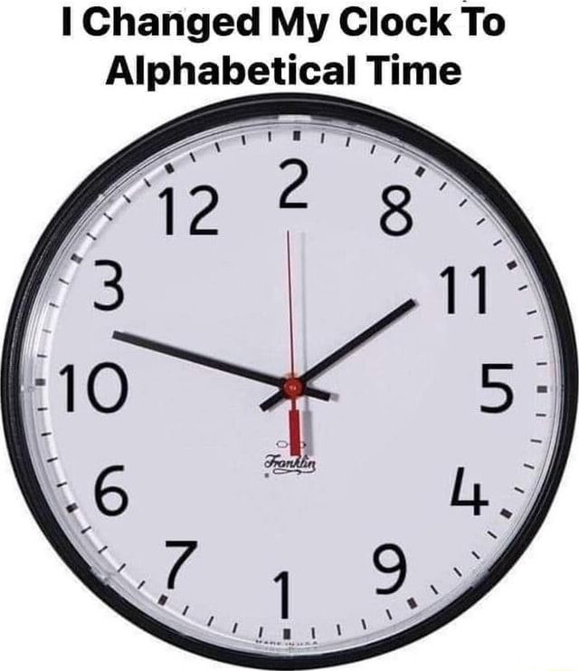

# Alphabetical Time
A correct clock

## Explanation
This is a shitpost clock that replaces the hour and minute digits with the digits written out as words and sorted alphabetically.

For example, say you had a clock that went `0, 1, 2, 3, 4, 5`. Write out the numbers:
```text
zero
one
two
three
four
five
```
Sort them:
```text
five
four
one
three
two
zero
```
Now map the digits back together, and you have a clock that goes `5, 4, 1, 3, 2, 0`. So, if the time were `0:2`, you'd map those numbers to the sorted array, and have a time that was instead `5:1`.

Do this for 12 or 24 hours, and 60 minutes, and you've made an alphabetical clock!

You can see the exact ordering used in the constants at the top of [`time.js`](time.js).


## FAQ
**Q. Why is this clock so wrong?**  
Pretty sure your clock is the one that's wrong.

**Q. What timezone does this display in?**  
Your browser's local time.

**Q. Why does it always display in 12 hour time by default?**  
Because the [recommended ways to detect 12 vs 24 hour locale time](https://stackoverflow.com/questions/60740996/detect-if-users-locale-is-set-to-12-hour-or-24-hour-timeformat-using-javascript) hurt my brain and made me sad, so I decided to not.

**Q. Why are the alphabetical hours of 12 hour and 24 hour time so different?**  
`0-23` and `1-12` sort into very different orders.

**Q. Why is the difference from "normal" time incorrect?**  
The difference from normal time is calculated for the hours and minutes separately. If the "normal" time is `1:53`, and the alphabetical clock says `11:27`, `11-1=10` and `53-27=26`, so it has a difference of `10 hours` and `26 minutes`.

If you think this is too confusing, I implore you to consider the clock you're looking at.

## Origin
Inspired by this meme:



## Legal
Apache 2.0 licensed
